# BlosSOM How-To

## Introduction
BlosSOM is an interactive C++ visualisation app of
(CUDA-)[EmbedSOM](https://github.com/exaexa/EmbedSOM) dimensionality reduction
algorithm for semi-supervised analysis of multi-dimensional data, mostly flow
cytometry data. The main functionality is roughly as follows:

- You load a high-dimensional datasets
- You use one of several available algorithms to find good high-dimensional landmarks in the dataset
- Either manually or with a layouting algorithm, you find good corresponding 2D positions for all landmarks, optionally adding or removing the landmarks
- You dynamically get a 2D visualization of the whole dataset that corresponds to your layout of the landmakrs.

All steps can be done in any order and interactively combined, which allows you
to freely explore various aspects of your dataset.

We assume that you have BlosSOM and all dependencies installed (as described in the [README](./README.md)).

For illustration, we use the [clusters dataset](./demo_data/clusters_labeled.tsv) available in `./demo_data/clusters_labeled.tsv`.

## Tools

BlosSOM contains several "tools" to manipulate your loaded data:

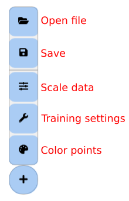

- **Open file:** Load FCS and TSV files
- **Save:** Export the current state of your dataset, e.g. the 2D coordinates of points and landmarks.
- **Scale data:** Transformation and scaling functions (such as `asinh` or standard deviation adjustment)
- **Training settings:** Management of various dynamic algorithms for optimizing the landmark positions
- **Color points:** Point drawing support, mainly
    - data-based colors (also called "expression" colors in cytometry), with many palettes
    - cluster coloring (using a discrete assignment stored in a file dimension)

Each of the tools has a reset button to clear out any custom settings and bring the training to the initial state.

## Loading the data

After starting BlosSOM, click the "plus" button in the lower right, click "Open
file", find the demonstration dataset in `./demo_data/clusters_labeled.tsv`,
and confirm the dialog. You should get a view like this:

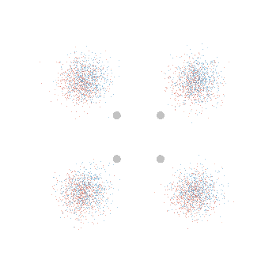

The 4 points are the initial landmarks, that by default form a miniature
self-organizing map that fits into your data. The dataset is 4-dimensional cube
of normally distributed clusters, which the SOM projects as a slightly squashed
structure (each cluster in the screenshot actually contains 4).

To get a more detailed or perspective view, use the mouse wheel to zoom.

## Adding and managing landmarks

To add a bit of detail to the display, you need to add landmarks, using
Ctrl+left mouse button.

After adding some landmarks, you may get a situation like this:

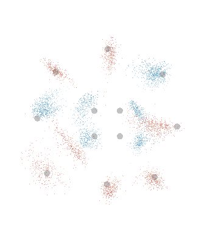

You may notice that the clusters nicely separate if more landmarks are
available; showing all 2^4=16 clusters. You can reposition the landmarks
together with their clusters just by dragging them with the mouse.

## Training the high-dimensional landmarks

By default, the landmark positions are optimized using the self-organizing map
algorithm. Use the "Training settings" tool to change the "radius" (aka
*sigma*) of the SOM training. After a bit of tuning, you should be able to make
both coarse-grained and fine-grained views of the dataset. Adding a few more
landmarks, you can get a highly optimized view of the data as follows:

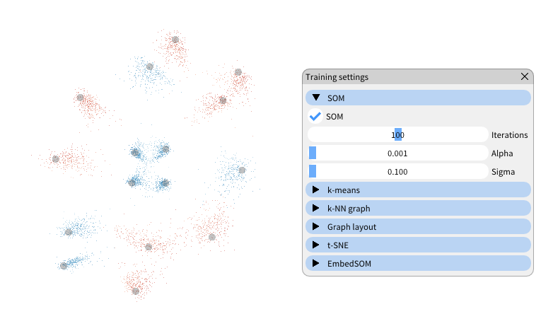

## Visualizing the dataset features

Use the "Color points" tool to check that the cluster positions are in fact
optimized to keep the similar clusters together. If the dataset is not very
big, you may reduce the transparency to get a better view of the points.

Also, never forget to try the better color pallettes.

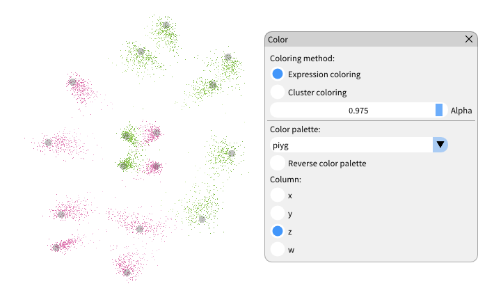

## Optimizing the low-dimensional landmarks

Once you are sure that the high-dimensional landmarks describe the dataset
right, you can use an automated approach to find a good 2D representation for
their layout.

In the "Training settings" tool, turn of the SOM training, and instead choose
generation of a `k`-NN graph, and force-based layouting of the landmarks using
that graph. If you select 4-nearest neighbors (which corresponds to the
structure in the hypercube), you should get an understandable representation of the actual
hypercube:

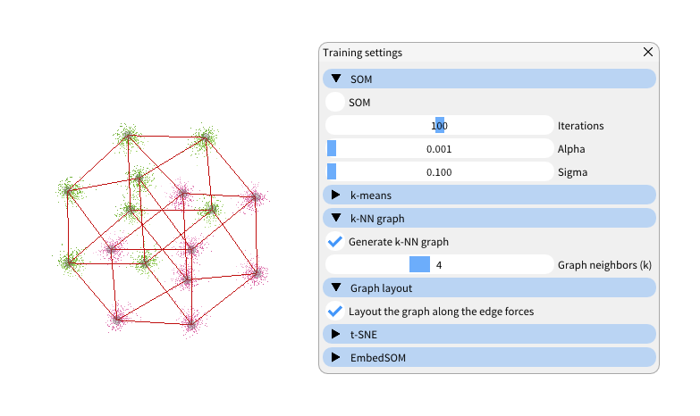

In contrast, applying t-SNE creates a less regular, but less crowded layout (that may be very useful for more complex, higher-dimensional datasets):

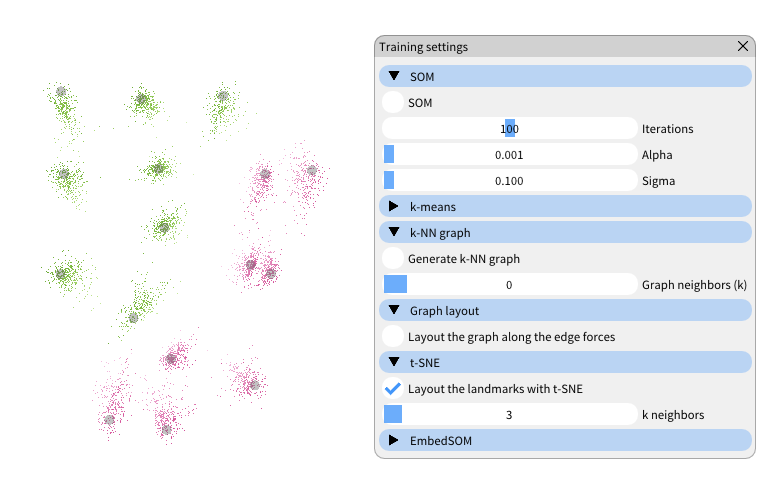

Notice you can still drag the clusters to a better layout (possibly escaping
local minima), while still keeping the projection realistic for all points.

## Detailed tools overview

#### Open file
Choose the file you want to open in the open file dialog window. Currently supported formats are FCS standard and tsv.

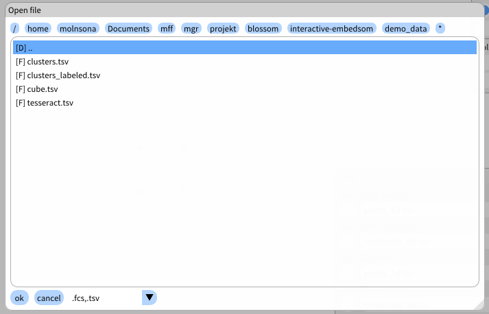

#### Save
Choose the data you want to save, set the names of the exported files and subsequently, after presssing the Save button, choose the directory you want to store the files in.

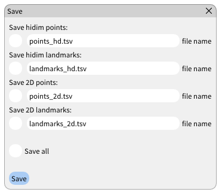

#### Scale data
Transform and scale data separately by dimensions. Each line begins with a name of the dimension followed by transform and scale settings for the current dimension.

#### Training settings
Choose algorithms you want to use for training the data and for layouting the landmarks, and set their parameters.

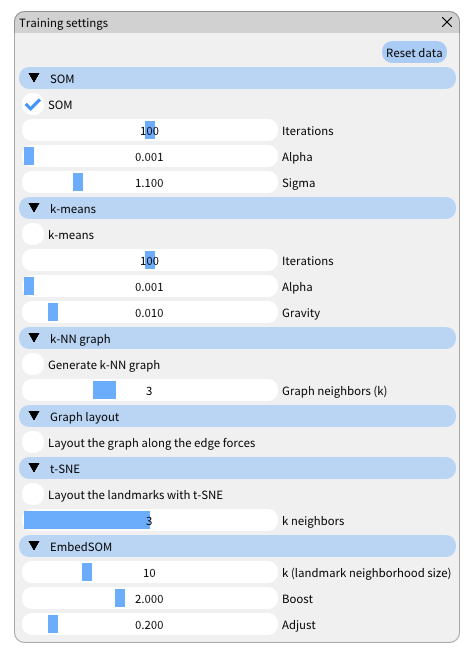

### Color points
Choose the coloring method for coloring 2D data points(not landmarks) out of two available methods: expression and cluster coloring. Each method can set the Alpha channel of the RGBA color system and a dimension by which the color will be sampled.   

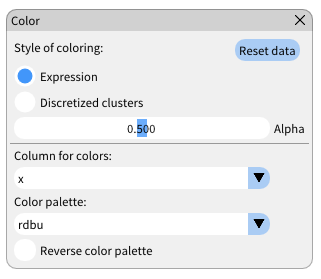
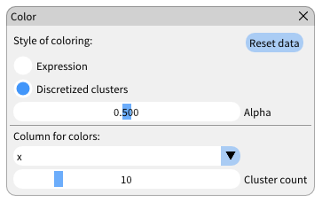

## Controls listing

- Move: Arrows
- Zoom in/out: Mouse wheel
- Drag landmark: Left mouse button
- Add/duplicate landmark: Ctrl + Left mouse button (click anywhere)
- Remove landmark: Ctrl + Right mouse button (click on the landmark you want to remove)
- Center at mouse cursor: Click mouse wheel (middle mouse button)
