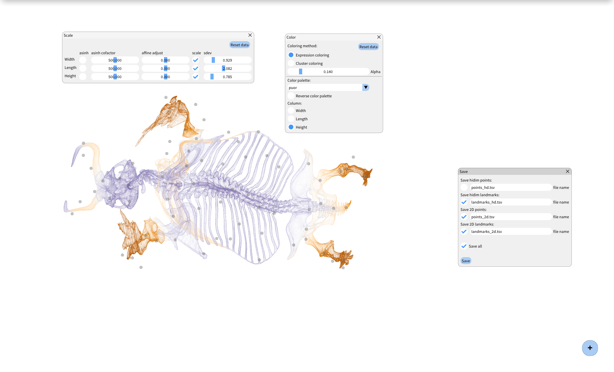

# BlosSOM :blossom:

BlosSOM is a graphical environment for running semi-supervised dimensionality
reduction with [EmbedSOM](https://github.com/exaexa/EmbedSOM). You can use it
to explore multidimensional datasets, and produce great-looking 2-dimensional
visualizations.

**WARNING: BlosSOM is still under development**, some stuff may not work right,
but things will magically improve without notice.  Feel free to open an issue
if something looks wrong.

- :question: [Overview](#overview)
- :wrench: [Compiling and running](#compiling-and-running-blossom)
- :arrow_right: [How-To](HOWTO.md) :bulb:
- :blue_book: [Documentation](#documentation)



BlosSOM was developed at the [MFF UK Prague](https://www.mff.cuni.cz/en), in cooperation with [IOCB Prague](https://www.uochb.cz/).

 
 

## Overview

BlosSOM creates a landmark-based model of the dataset, and dynamically projects
all dataset point to your screen (using EmbedSOM). Several other algorithms and
tools are provided to manage the landmarks; a quick overview follows:

- High-dimensional landmark positioning:
    - Self-organizing maps
    - k-Means
- 2D landmark positioning
    - k-NN graph generation (only adds edges, not vertices)
    - force-based graph layouting
    - dynamic t-SNE
- Dimensionality reduction
    - EmbedSOM
    - CUDA EmbedSOM (with roughly 500x speedup, enabling smooth display of a few millions of points)
- Manual landmark position optimization
- Visualization settings (colors, transparencies, cluster coloring, ...)
- Dataset transformations and dimension scaling
- Import from matrix-like data files
  - FCS3.0 (Flow Cytometry Standard files)
  - TSV (Tab-separated CSV)
- Export of the data for plotting

## Compiling and running BlosSOM

You will need [cmake](https://cmake.org/) build system, [GLFW](https://www.glfw.org/) OpenGL library and [GLM](https://www.opengl.org/sdk/libs/GLM/) mathematics library for graphics.

For CUDA EmbedSOM to work, you need the [NVIDIA CUDA toolkit](https://developer.nvidia.com/cuda-zone).
Append `-DBUILD_CUDA=1` to `cmake` options to enable the CUDA version.

### Windows

A version for Windows is currently not supported but may be in the future,
stay tuned.

### Linux (and possibly other unix-like systems)

#### Dependencies
The project requires GLFW and GLM as an external dependency. Install `libglfw3-dev`, `libglm-dev` and `libgl-dev` (on
Debian-based systems) or similar
(depending on the Linux distribution). You should be able to install `cmake`
package the same way.

#### Compilation
```sh
git submodule update --init --recursive

mkdir build
cd build
cmake .. -DCMAKE_INSTALL_PREFIX=./inst    # or any other directory
# to compile CUDA, set proper gcc/g++ compiler compatible with your version of CUDA/nvcc
# cmake .. -DCMAKE_INSTALL_PREFIX=./inst -DBUILD_CUDA=1 -DCMAKE_C_COMPILER=/usr/bin/gcc-10 -DCMAKE_CXX_COMPILER=/usr/bin/g++-10
make install                              # use -j option to speed up the build
```

#### Running
```sh
./inst/bin/blossom
# to run CUDA version
# ./inst/bin/blossom_cuda
```

## Documentation

- Basic usage of the software and the description of the user interface is available in [HOWTO.md](./HOWTO.md).
- Some technical details about the code may be found in [src/README.md](./src/README.md).
- Doxygen-generated documentation of the source code can be found at https://molnsona.github.io/blossom/

### Quickstart
1. Click on the "plus" button on the bottom right side of the window
2. Choose **Open file** (the first button from the top) and open a file from the `demo_data/` directory
3. You can now add and delete landmarks using ctrl+mouse click, and drag them around.
4. Use the tools and settings available under the "plus" button to optimize the landmark positions and get a better visualization.

See the [HOWTO](./HOWTO.md) for more details and hints.

### Performance and CUDA

If you pass `-DBUILD_CUDA=1` to the `cmake` commands, you will get extra
executable called `blossom_cuda` (or `blossom_cuda.exe`, on Windows).

The 2 versions of BlosSOM executable differ mainly in the performance of
EmbedSOM projection, which is more than 100× faster on GPUs than on CPUs. If
the dataset gets large, only a fixed-size slice of the dataset gets processed
each frame (e.g., at most 1000 points in case of CPU) to keep the framerate in
a usable range. The defaults in BlosSOM should work smoothly for many use-cases
(defaulting at 1k points per frame on CPU and 50k points per frame on GPU).

If required (e.g., if you have a really fast GPU), you may modify the constants
in the corresponding source files, around the call sites of `clean_range()`,
which is the function that manages the round-robin refreshing of the data.
Functionality that dynamically chooses the best data-crunching rate is being
implemented and should be available soon.

## License

BlosSOM is licensed under GPLv3 or later.
Several small libraries bundled in the repository are licensed with MIT-style licenses.
